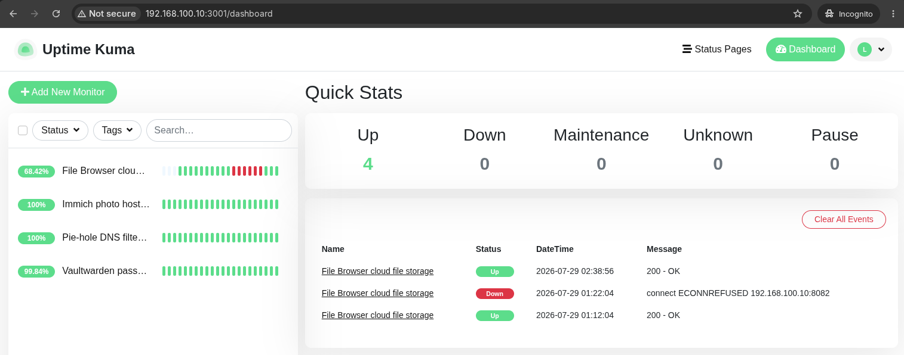
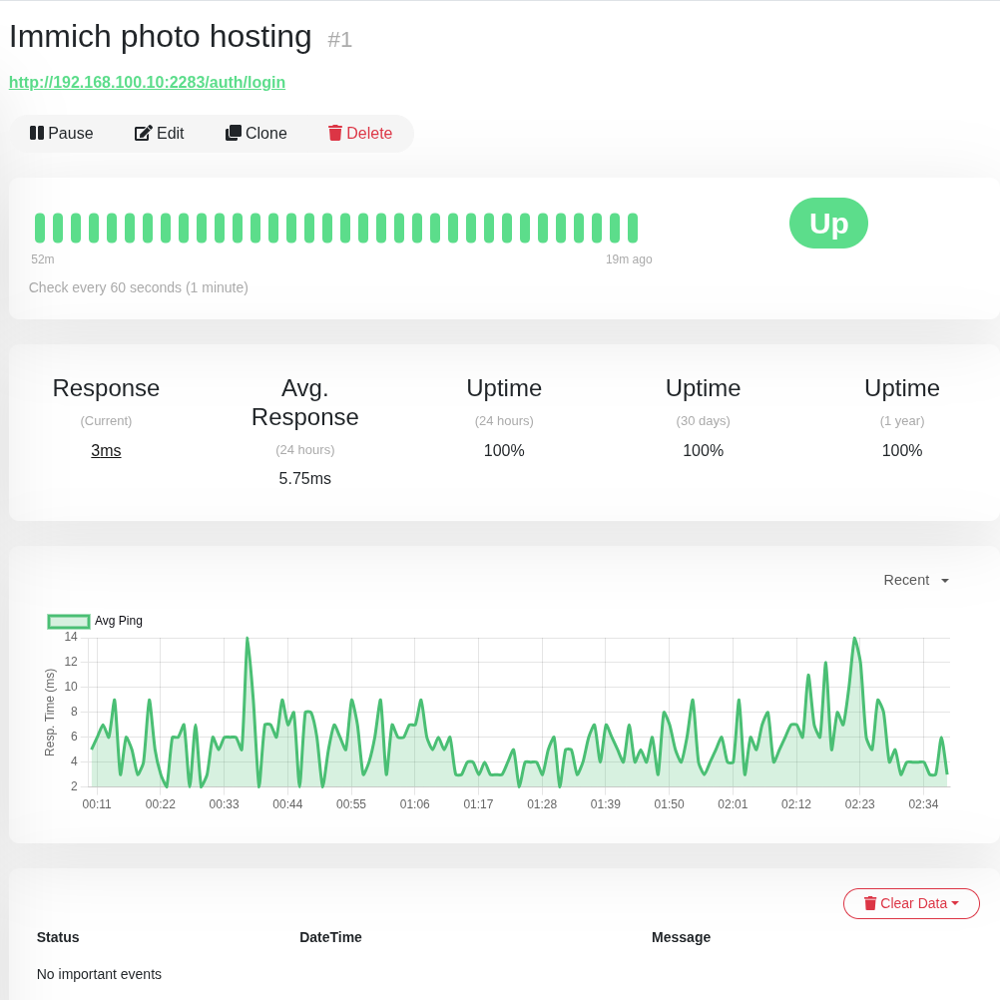
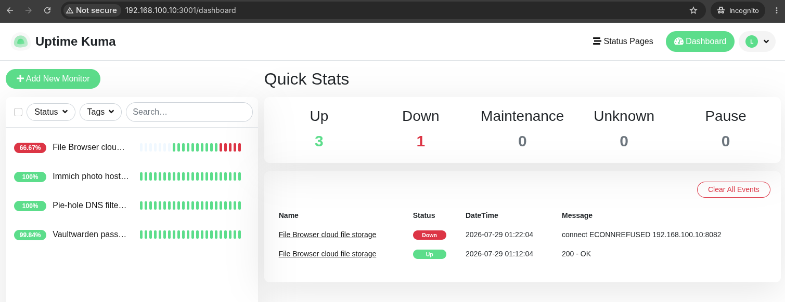
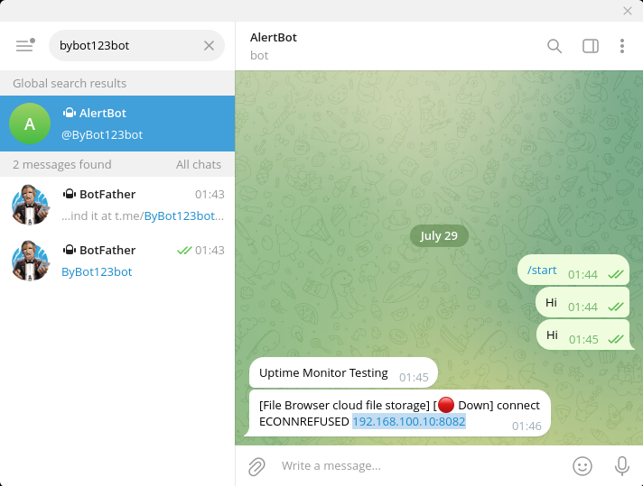
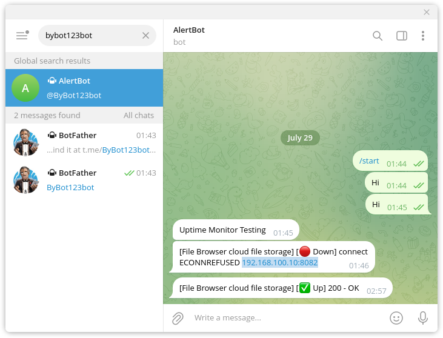

# Session 8 — Monitoring with Uptime Kuma

> 💡 **Note for students:** This README is a real example from the instructor's own lab, kept at the level of detail you should aim for. Where something is worth noticing, you'll see a callout like this one.

## What I built

This week I added Uptime Kuma to the lab stack — a self-hosted monitoring dashboard that keeps an eye on whether my other services are actually up and running. It watches Pi-hole, File Browser, and Immich right now, and I'll add more as I deploy them. It is the first service in this lab that isn't really for use directly — it's for keeping tabs on everything else. I also connected it to a Telegram bot, so I get notified the moment something goes down instead of having to check the dashboard myself.

> 💡 **Why this matters as an example:** Notice the README doesn't just say "installed Uptime Kuma." It says what it's actually monitoring, right now, specific to this build.

## Why this one matters

This is not:
> "I installed a monitoring tool."

This is actually all about:
- service availability — knowing something is down before a user tells you
- outage detection — the difference between "it's down" and "it's been down for 24 hours"
- operational monitoring mindset — this is what ops and platform teams actually do all day
- alerting — a dashboard nobody's watching is basically useless; the notification is what is actually most important

## Deployment

Deployed via Docker Compose alongside the rest of the stack. Simple config lives in `docker-compose.yml` added here.

## Telegram Bot Notifications

I set up a Telegram bot so Uptime Kuma can notify me immediately when something goes down, instead of relying on me remembering to check the dashboard.

Steps I followed:
1. Created a new bot via **@BotFather** on Telegram and got the bot token
2. Started a chat with my new bot
3. In Uptime Kuma, went to **Settings → Notifications → Setup Notification**, selected **Telegram**, pasted in the bot token, and clicked **Auto Get** to pull the Chat ID automatically
4. Turned on this notification to all three monitors (Pi-hole, File Browser, Immich)
5. Hit **Test** — got a message on Telegram within a couple seconds confirming it worked
6. Manually stopped a container afterward to confirm the alert actually fires for a real outage, not just the test button

> 💡 **Why this matters as an example:** This is the piece that turns monitoring from "a dashboard I sometimes remember to look at" into something actually operational. Real teams don't stare at dashboards all day — they get paged. This is your mini version of that.

## What I tested

- Opened `http://server-ip:3001` and completed the first-run setup (admin account, test credentials only)
- Added three monitors:
  - Pi-hole — HTTP check on port 80
  - File Browser — HTTP check on its port
  - Immich — HTTP check on its port
  - Vaultwarden - HTTP check on its port with custom extra host and Ignore TLS for now 
- Set check interval to 60 seconds for all
- Manually stopped the File Browser container to confirm Uptime Kuma actually caught it — it flagged the outage within about a minute, logged the downtime, and I got a Telegram message on my phone within seconds of the check failing

> 💡 **Why this matters as an example:** That last bullet is the important one. Anyone can screenshot a green dashboard. Deliberately breaking something to prove the monitoring — and the alert — actually works is what shows you understand what the tool is for.

## One problem I hit and how I fixed it

First attempt, Pi-hole kept showing as down even though it was clearly running — I could open it fine in the browser. Turned out I'd pointed the monitor at the wrong port (I used 53, which is DNS, not the web interface). Changed the monitor to check the correct HTTP port and it went green immediately.

> 💡 **Why this matters as an example:** This is the section that students often skip writing as unimportant, and yet it's the one that matters most. A perfect setup with no notes shows nothing. A mistake explained clearly shows you can actually troubleshoot and solve problems — and that's what the job is most often about.

## Screenshots

**Dashboard — all services healthy**

**Monitor configuration**

**Dashboard mid-outage — Pi-hole flagged down**

**Telegram alert — outage notification**

**Telegram alert — service restored**

## Next up

Session 9 — Reverse Proxy and HTTPS with Nginx Proxy Manager.
